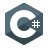

<!-- MORE https://github.com/alexandresanlim/Badges4-README.md-Profile -->

<h3 align="center">
    Welcome to Firdavs Muzaffarov's profile!
    
</h3>

<!--ANIMATED WELCOME TEXT -->

    

## 🙋‍♂️ Connect with me

<!-- Badges template - https://github.com/sohibjaynarov -->

    
    
     

## 🔨 Languages and Tools:
    
[][html]
[][css]
[][python]
[][c]
[][csharp]
[][postgresql]
[][vscode]
[][jetbrains]
[][powershell]
[][git]
[][github]
[][linux]
[][windows]

 
 

## 🔰 Miscellaneous (tap to open each)

  
⚡ Overall GitHub Stats

  

  
 
  
  

  
⚜ Last month's activity

  
   

  

## 💻 Last month's activity
<!-- https://github.com/sohibjaynarov/github-readme-activity-graph -->

---

[html]: https://www.w3schools.com/html/default.asp
[css]: https://www.w3schools.com/css/default.asp
[python]: https://www.python.org/
[csharp]: https://docs.microsoft.com/en-us/dotnet/csharp/
[c]: https://www.learn-c.org/
[postgresql]: https://www.postgresql.org/
[vscode]: https://code.visualstudio.com/
[jetbrains]: https://www.jetbrains.com/
[powershell]: https://docs.microsoft.com/en-us/powershell/
[git]: https://git-scm.com/
[github]: https://github.com
[linux]: https://www.linux.org/
[windows]: https://www.microsoft.com/en-us/windows

